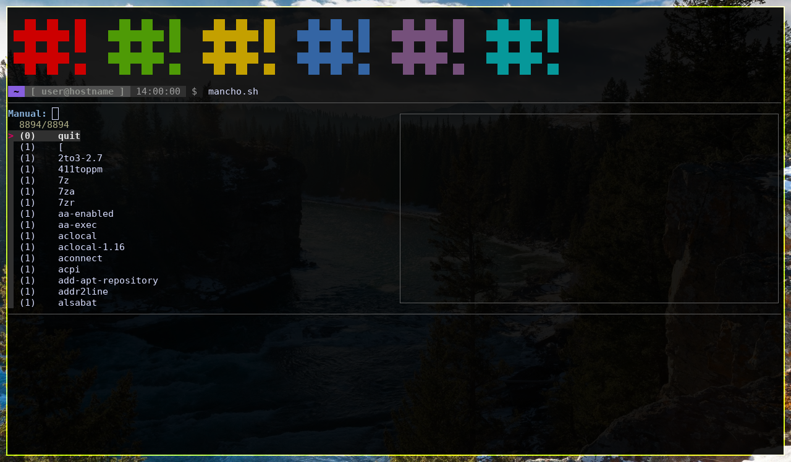
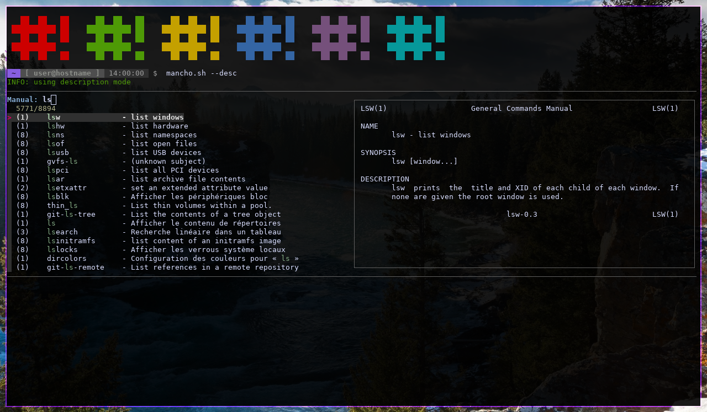

# A *Good* Tutorial for mancho.sh

## IMPORTANT NOTE:

> This program, and in particular help pages, uses frequently words that can be misinterpreted : `man`, `master`, `macho.sh`, and so on.
> 
> **It is in NO CASE RACISM or SEXISM. These are just SOFTWARE NAMES and DIMINUTIVES.**
>
> More infos [here](../README.md#important-note-and-name-explainations-d).

---

# Index

* [Introduction](../README.md) (ref to README.md)
* [First steps with mancho.sh](#first-steps)
* [Open a manual page](#open-a-manual-page)
* [The Daily Lists](#daily-lists)
* [Updates](#updates)
* [Use the *real* man](#pass-arguments-to-man)
* [Configuration](#configuration)

Don't hesitate to open an issue or send me a mail if you can't figure out something !

---

# First Steps

## Simplify executing mancho.sh

mancho.sh calls the `man` command if it needs to, so I highly recommend you to alias `man` to `mancho.sh` if you want to use it often :

#### For the `bash` shell

        echo "alias man='mancho.sh'" >> ~/.bashrc

#### For the `zsh` shell

        echo "alias man='mancho.sh'" >> ~/.zshrc

---

To apply the alias in the current session, just execute :

        alias man='mancho.sh'

> NOTE: in the following steps, you will not see the `man` command to do not be confused with the alias and the actual program.

# Open a manual page

It's for sure the thing you'll use the most with mancho.sh. To call a manual, just do as if you were using `man` :

        mancho.sh MANUAL_NAME

Now if you want to open the finder, maybe to have a preview of the man page, you'll juste use :

        mancho.sh

You'll probably see the script doing some stuff before even printing the finder : nothing to be affraid of ! It is just searching for eventual updates and creating the daily program lists. This happens once a day to save your time. For more infos about lists, look at [this](#daily-lists). Let just keep moving for now.

So we just entered `mancho.sh`. What happens now is it shows you the fuzzy finder (aka fzf, [their page here](https://github.com/junegunn/fzf/tree/master/)). You'll probably see something like this : (except the top of my terminal)

### Description of fzf's interface

> NOTE: fzf's default settings are not those used by mancho.sh, but you can set them in the configuration file (infos [here](./config.md), /!\\ advanced use).
>
> Mancho.sh's setting string :
>
>         export FZF_DEFAULT_OPTS="--height=50% --border --layout=reverse --prompt='Manual: ' --preview='echo {1} | sed -E \"s/^\((.+)\)/\1/\" | xargs -I{S} man -Pcat {S} {2} 2>/dev/null'"

*With mancho.sh's default settings :*

| Part of fzf          | Description |
|----------------------|-------------|
| Left Side            | List of commands (the number tells about its man category, infos : `man man` at "DESCRIPTION")
| Right Side           | Preview of the manual page |
| Top Left "Manual: "  | A kind of prompt where you enter the string to search for |
| Top Left "8894/8894" | (or other values) Printed possibilities / total possibilities |

Note that you can use the mouse in fzf if your terminal supports it.

---

Let's move on ! If you don't remember a command's name or you just want to find a command which does a particular action, you can use **description mode** :

        mancho.sh -d
        mancho.sh --desc

Mancho.sh looks about the same as before, but there's an added column in the command list : it's the description of the command on the same line.

> You should not enable description mode by default because it changes the way fzf lists and selects the possibilities. Try to search for `ls`, you'll probably get something like this :
> 
> 

# Daily Lists

You may have noticed that once a day, mancho.sh creates "daily lists" if you execute it so it prints the finder. On some systems, and in particular if you've installed lots of programs, the manual pages can be very numerous (in my case, you've seen on the screenshots that I have 8894 manuals).
It can take a *long* time to load the list every times (in fact, just a few frustrating seconds...), so I came to the solution where a standard list and a description list are made for each day. They are located in `~/.config/mancho.sh/list` and `~/.config/mancho.sh/list.desc`.

You can update them with the following command (for ex. if you download a new program, it won't stand in them without a refresh)

	mancho.sh --sync

This command will also look for eventual updates.

# Updates

As mensioned above, mancho.sh checks if there's an update every time it refreshes its list files (=> automaticly and daily).

### Get the version

Nothing easier ! Just use one of these :

        mancho.sh --version
        mancho.sh --vers
        mancho.sh -v

### Change logs

Change logs contain the changes made for each mancho.sh version (and sub-version as well). You can find every change log since version `1.3.1` in [this](../global_change_logs.md) file. But if you want to print the news of an update, you can use one of these commands :

        mancho.sh --update-log
        mancho.sh --upd-log
        mancho.sh --upd-l

You'll see :

* Your installed mancho.sh's current version
* Your installed mancho.sh's current version's change logs
* If your version is not up to date :
  * The latest available mancho.sh version
  * The latest available mancho.sh version's change logs
* If your version is the latest :
  * A message telling you mancho.sh is already up to date

For exemple, my mancho.sh version `1.4.0` returns this :

        Current mancho.sh version : 1.4.0     ;     change logs :
        added change logs (now stable)
        finished update function for now
        updated help pages : added update options
        Already up to date, no newer change log.

### Update mancho.sh

To update mancho.sh, all you need to do is execute this :

        mancho.sh --update

(and for the lazy one : )

        mancho.sh --upd

Mancho.sh will download it for you.** *Warning !* Mancho.sh will tell you one or two other commands to execute :** if it did those, bash would panic.

# Pass arguments to man

Somethimes, you'll may want to use man's built-in options. You could simply unalias mancho.sh, but you don't need it - I got the solution !

If mancho.sh receives an option he does'nt know, it will pass them to `man`. But you need to know how that works :

* If mancho.sh does not recognize the **very first argument**, it will give **every** argument to man **ONCE** in the **SAME COMMAND**,
* whereas if it gets a known **first argument**, it will give every **unknown** argument to man **ONE AT A TIME**, in **SEPARATE COMMANDS**

Thats's why there's a `--` argument which tells mancho.sh that all the following arguments are to be given to man.

### With a known first argument

        mancho.sh --help getcpu 2

=> This will :
  * print mancho.sh's help page
  * execute `man getcpu`
  * and THEN execute `man 2`

### With an unknown first argument

        mancho.sh getcpu 2 --help

=> This will :
  * execute `man getcpu 2 --help`

### With a known first argument using `--`

        mancho.sh --help -- getcpu 2

=> This will :
  * print mancho.sh's help page
  * execute `man getcpu 2`

# Get the built-in help

For the *quick* help :

        mancho.sh -h
        mancho.sh -help
        mancho.sh --help
        mancho.sh -q
        mancho.sh --quick
        mancho.sh --quick-help

For the *complete* help :

        mancho.sh -H
        mancho.sh --long-help
        mancho.sh --help-long

For the `man` program's help

        mancho.sh --man-help
        mancho.sh -- -h
        mancho.sh -- --help

# Configuration

The configuration file is in `~/.config/mancho.sh/config.sh`. It is in fact an included bash script, so you can do way more than just setting variables.

It is not present by default, so you can generate it with :

        mancho.sh --mk-config

> This is considered as *advanced use*, please reffer to [this](./config.md) file, which is made specially for help about configuration.
